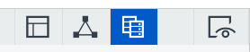

# CDE 使用指南

## 起步知识

* 布局
* 组件
* 数据源



CDE将布局，组件，数据源进行的划分。

布局负责

## 使用布局

## 两个Dashboard传参

获取：

`Utils.getQueryParameter("paramName");`

设置参数：

`dashboard.fireChange("paramName",value);`

## Echarts联动思路

对图形的点击绑定`click`事件，并进行如下操作  
**1**. 传递参数  
ajax异步加载实现，通过CDA文件获取  
**2**. 刷新关联图形  
重新渲染Echarts图形，实现刷新功能

### 封装AJAX请求

通过指定CDA文件进行数据获取，构造函数如下：

```javascript
// url:
// /pentaho/plugin/cda/api/doQuery
// ?path=public/testWind/testChartCDE_winds.cda
// &dataAccessId=departmentEmplNum
function readJSONFile(url){
    let jsonData;
    $.ajax({
        type: 'GET',
        url: url,
        async: false,
        dataType: 'json',
        data: null,
        success: function(response){
            jsonData = response;
        }
    });
    return jsonData;
}
```

### 封装图形数据格式化

根据不同图形要求，将获取数据进行翻译，变成所需的格式，如下：

```javascript
// 柱形图简单示例
function BarTranslate(data,instance){
    let title = {
        text: 'bar title',
    },
    xAxis = {
        type: 'category',
        axisLabel: {
            interval: 0
        },
        data: data.map(function(item){return item[0]})
    },
    yAxis = {
        type: 'value',
    },
    series = [{
        data: data.map(function(item){return item[2]}),
        type: 'bar'
    }];

    let option = {
        title,
        xAxis,
        yAxis,
        series
    };

    instance.setOption(option);
    window.addEventListener('resize',function(){
        instance.resize();
    });
    return option;
}
```

