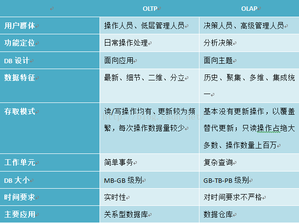

# OLAP 基础知识

## 简介

联机实时分析（Online Analytical Processing, OLAP）技术是多维分析（Multipledimensional Analysis, MDA）的一种解决方案。

多维分析：多维分析是一种数据分析过程，过程中数据被分为两类  
1. 维度（dimensions）  
2. 度量（metrics/measurements）  
维度和度量都来自图论（graph theory），维度指能够描述某个空间中所有点的最小坐标数，即空间基数；度量指的是无向图中顶点间的距离。

在多维分析领域，维度一般包含字段值为字符类或者字段基数值较少且作为约束条件的离散数值类型（感觉类似于category）；度量一般包括基数值较大且可以参与运算的数值类字段，一般也称为指标（就是对应的值）。

### OLAP cube

OLAP cube 在数据库理论（database theory）中的定义为：RDBMS（关系型数据库管理系统）关系映射中的一种现象描述。

OLAP cube可以简单描述为“多维数据集”。可以抽象想象为数据指标根据多维度封装成的一个立方体结构（维度超过3则称为“Hypercube”）

在OLAP分析中，我们通常也对维度指标进行分层组织（Level），即一系列的parent-child关系（Hierarchy）；父类维度可以看作子类维度的聚合。

### 维度模型

维度模型概念出自数据仓库领域，是数据仓库建设中的一种数据建模方法。维度模型主要由**事实表**和**维度表**两个基本要素构成。

事实表是维度模型的基本表，用于存放大度量值。维度值的列表定义了事实表的粒度，同时又确定了度量值的取值范围。  
事实表的一行对应一个度量值，事实表的所有度量值必须具有相同的粒度。事实可能是半加性质的或非半加性质的，半加性事实表示度量值可以沿着某些维度由子类维度向父类维度聚合；非加性事实则完全不能相加，只能采用计数或者求平均值，或者打印出全部事实行的进行分析。

维度表是事实表不可分割的部分。维度表是进入事实表的入口。丰富的维度属性给出了丰富的分析切割能力。

两者的融合也就是“维度模型”，一般采用“雪花模式”或者“星形模式”

## 基本分析操作

### 上卷（Consolidation/Roll-up）

表示沿着某一维度按照一定规则（rule）对数据进行聚合（aggregation）操作，沿着某一维度，即按照层级关系从子类维度向父类维度作聚合。

### 下钻（Drill-down）

与上卷正好相反，允许用户从已聚合的数据集中提取出所关注的细节。

### 切片（Slice）

表示通过选择某一维度的单一值，从OLAP cube中抽取出一个分片的过程。

### 切块（Dice）

表示通过选择多个维度的某些值（或者取键），从OLAP cube中抽取出子cube的过程

### 旋转（Pivot）

通过旋转，重新选择目标分析维度，通常表现为交换坐标轴。

## OLAP与OLTP的区别

## OLAP技术路线分类

### 关系型联机实时分析（ROLAP）

ROLAP主要依赖于关系型数据库，允许用户使用维度模型进行数据分析，将维度值存储在维度表中，将度量值存储在事实表中，通过关系型数据库访问数据，使用SQL进行查询分析。

一般使用模式如下：根据用户需求，对不同维度进行分析后，将分析数据导入到另一张数据库表中。

优势：

1. 处理高基数列具有更好的扩展性。
2. 擅长处理非聚合类的原始数据，生态圈内用于原始数据入库的ETL工具众多，同时比MOLAP入库速率更高。
3. 由于数据存储在关系型数据库中，所以支持标准SQL接口，查询便捷。

劣势：

1. ROLAP性能业界普遍认为是低于MOLAP的。当然这可能由于ROLAP的用户量比MOLAP数量多
2. 处理已聚合数据，需要使用定制的ETL工具，开发量大且不具有通用性；如果采用原始数据入库，将非常影响查询性能。提升性能需要将已入库的原始数据重新聚合后再导入新表中进行查询分析。
3. ROLAP性能很大程度上依赖于关系型数据库的查询与缓存性能；对于所有分析操作，都依赖于SQL语句，对于重计算类的分析模型，转换后的SQL会变得复杂，对分析者的SQL语句的调优要求比较高。而在某些无法使用SQL的场景下，ROLAP类产品则无能为力。

### 多维联机实时分析（MOLAP）

MOLAP是OLAP的经典使用模式，所以常用MOLAP来代指OLAP。MOLAP和ROLAP具有一定的相似性，二者都可以使用维度模型进行数据分析，但是MOLAP并不将数据存储在维度表或者事实表中，而是对原始数据进行预计算（比如聚合操作），将计算结果存储在OLAP cube中。

MOLAP的优势：

1. 由于MOLAP不采用关系型数据库进行数据存储，所以必须采用特殊的存储手段，比如：压缩存储、索引（位图索引）以及缓存技术等、查询速率更快；

MOLAP的劣势

1. 数据导入较慢，需要使用定制的ETL入库工具；
2. 由于没有维度表和事实表，所以对于更新操作以及明细查询，效率比ROLAP低很多。

### 混合型联机实时分析（HOLAP）

HOLAP充分利用了ROLAP与MOLAP的各自优势，从纵向角度、即允许用户将部分数据（比如聚合类数据）使用MOLAP进行存储，从而获得更快的查询性能；又允许部分数据（比如原始数据）使用ROLAP进行存储，使用户能够查看细粒度数据。从横向角度，使用MOLAP存储最近较热的数据，从而提升查询性能；而使用ROLAP存储历史较冷的数据。

